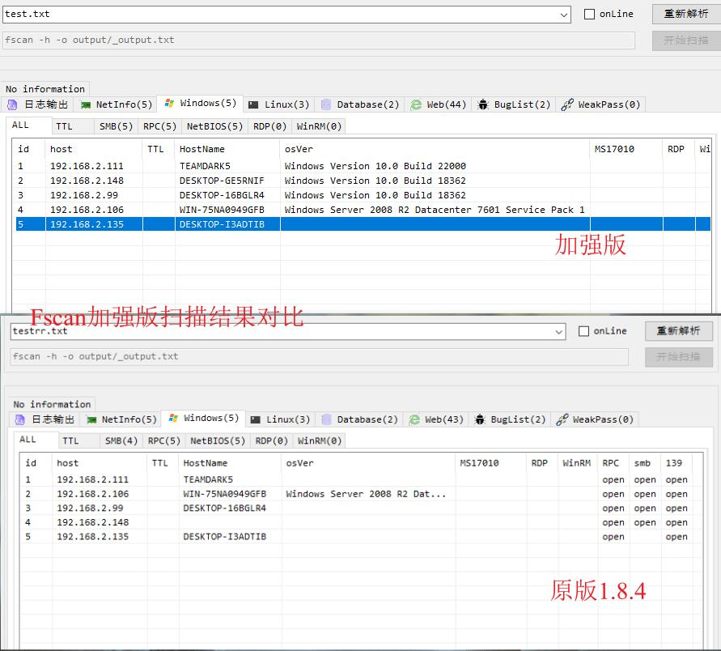

# FscanPlus
 这是Fscan的功能完善、增强、定制版本。

## 版本说明

现基于[fscan](https://github.com/shadow1ng/fscan)最新版1.8.4修改。

## 修改说明

1. 基于ntlmssp提升对Windows操作系统版本识别能力

## 更新

* 2024年9月11日 v1.0
  * 基于ntlmssp提升对Windows操作系统版本识别能力

## 致谢

* [fscan](https://github.com/shadow1ng/fscan)

  非常感谢shadow1ng能开源对我们新手这么好的扫描器！

* [Rcoil](https://github.com/rcoil/)

  一直想跟上R克row的节奏，但是一直跟不上，哭唧唧~
